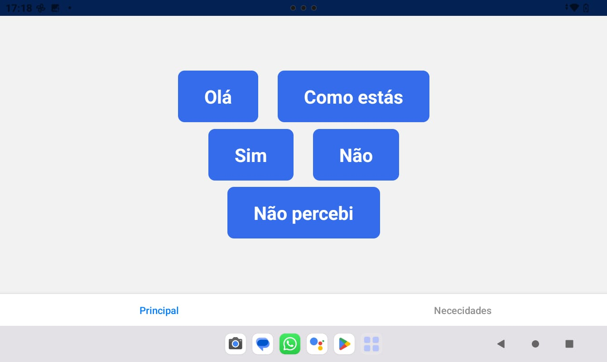
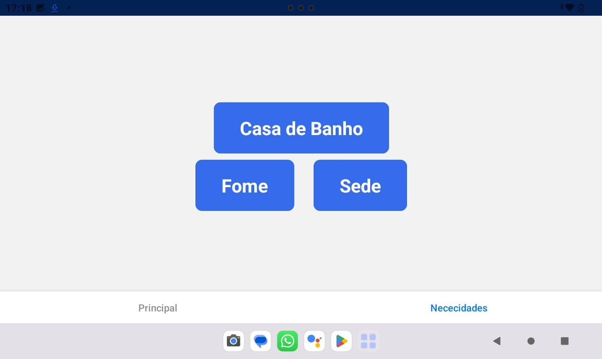

# Speechy - Version 1.0.0

Speechy is a very basic React Native mobile Alternative Speech (AAC) created as an experiment specifically for someone in my family that has trouble communicating with others after a stroke. It has a set of static programmed buttons containing words/ simple phrases 
that one can press. After pressing, the device reads out aloud the chosen phrase. As the family member didn't react to good to the application, I ended up leaving it as it is and keep it as an experience.

